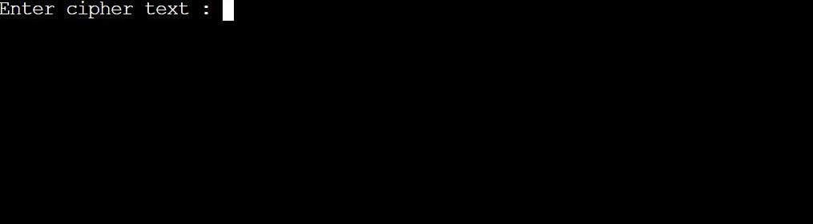
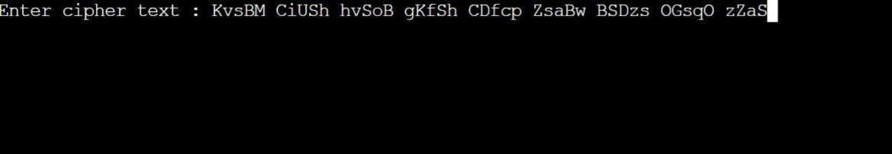
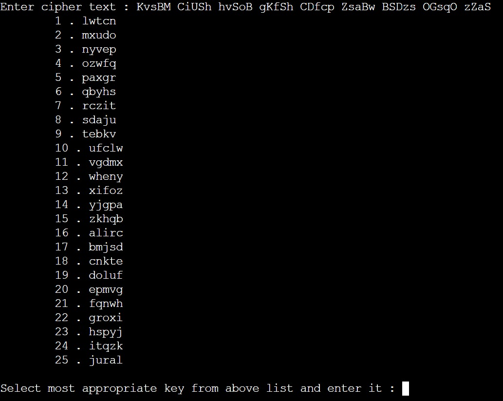
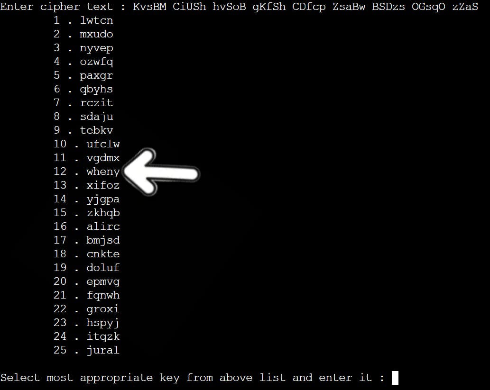
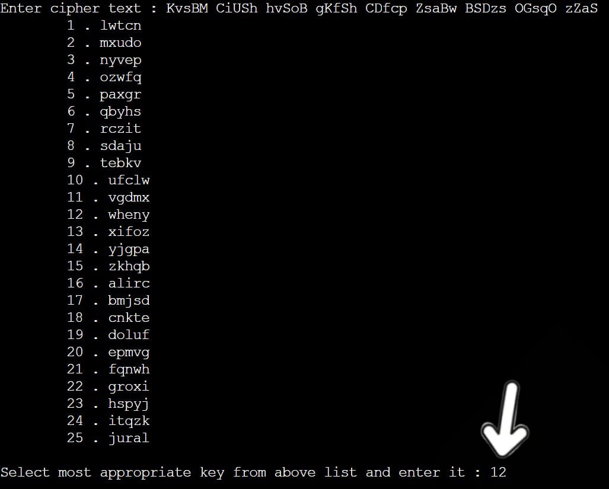
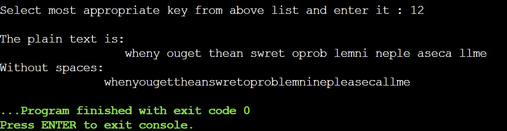

# Caesar Cipher Decoder (C Program)

## 📌 Overview
This project is a C-based Caesar Cipher decoder that performs brute-force decryption by trying all possible shift values (1–25). The user selects the correct key after viewing outputs.

## 🔗 Related Project
This project was later extended into a more advanced cipher implementation:

- [Multiplicative Cipher Decoder (C Program)](https://github.com/javeriakhan776/multiplicative-cipher-decoder)

## ⚙️ Features
- Brute-force Caesar cipher decryption (1–25 shifts)
- Handles uppercase and lowercase letters
- Supports full sentence input using `fgets`
- Preserves spaces during processing
- Generates cleaned output without spaces
- User selects correct decryption key manually

## 🧠 Concepts Used
- Arrays and strings in C
- ASCII character manipulation
- Loops and conditionals
- Input handling (`fgets`)
- Basic cryptography (Caesar cipher)

## 🚀 How to Run

1. Compile the program using a C compiler:

gcc main.c -o cipher

2. Run the program:

On Windows:

cipher.exe

On Linux/Mac:

./cipher

3. Enter the encrypted text when prompted and select the correct shift key.

## 📈 Learning Outcome

### Learnt:
- String input and output in C
- How characters can be manipulated using ASCII integer values
- ASCII values of characters and their role in encoding/decoding
- Input limitations of `scanf` with spaces

### Reinforced:
- Loops and nested loops
- Conditional statements
- Array traversal and string processing
- Basic algorithm design (Caesar cipher brute-force approach)

## 👨‍💻 Author

- 2nd semester Computer Science student  
- Inspired by the challenge of manually deciphering Caesar cipher text and building a program to automate the process  
- Created as a fun learning project to strengthen understanding of C programming and basic cryptography  

## 📸 Output Screenshots

### Step 1: Input Guide
Here the user enters the encrypted cipher text.

As follows:

---

### Step 2: Brute Force Output
The program generates all 25 shift possibilities.

The user identifies the appropriate key by identifying proper words from the list.
As in the following example, the only proper word is when at number 12.

Then the user enters that key.

---

### Step 3: Final Decryption
User gets the plaintext output.

